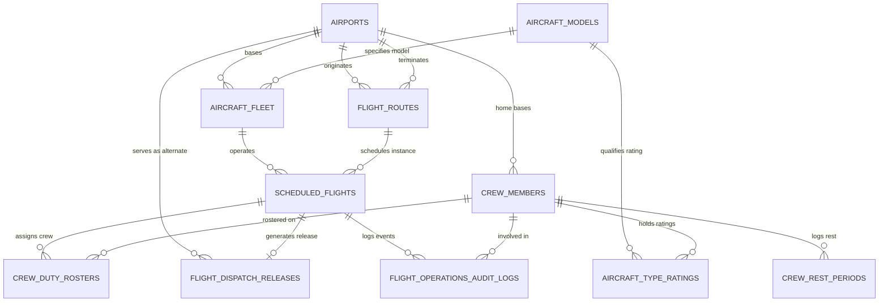

# ✈️ Airline Flight Dispatch & Crew Rostering Database System

[](https://www.mysql.com/)
[](https://dev.mysql.com/doc/refman/8.0/en/innodb-storage-engine.html)
[](#normalization--schema-design)
[](https://opensource.org/licenses/MIT)
[](#aviation-regulatory-rules-enforced)

A production-grade, 3NF-normalized relational database management system architected for commercial airline flight dispatch, aircraft fleet utilization, and regulatory flight crew rostering. 

Designed for university computer science and software engineering students as a comprehensive reference implementation for semester DBMS projects, advanced SQL lab coursework, and technical viva voce examinations.

---

## 📌 Table of Contents
- [Executive Overview](#-executive-overview)
- [Key Architectural Features](#-key-architectural-features)
- [Aviation Regulatory Rules Enforced](#-aviation-regulatory-rules-enforced)
- [Repository Structure](#-repository-structure)
- [Schema Architecture & Normalization](#-schema-architecture--normalization)
- [Entity-Relationship Diagram](#-entity-relationship-diagram)
- [Installation & Quickstart Guide](#-installation--quickstart-guide)
- [Stored Procedures & ACID Workflows](#-stored-procedures--acid-workflows)
- [Analytical Views & Complex Queries](#-analytical-views--complex-queries)
- [Viva Voce Examination Preparation](#-viva-voce-examination-preparation)
- [Git Setup & Remote Commands](#-git-setup--remote-commands)

---

## 🛫 Executive Overview

Commercial airline operations demand fault-tolerant, high-concurrency systems where safety compliance is non-negotiable. An inadvertent breach of crew flight duty limits, improper aircraft turnaround buffer, or an uncertified pilot operating a widebody aircraft carries catastrophic regulatory and life-safety penalties.

This repository implements the database backbone of an Airline Flight Operations Center (AOC), managing:
- **Aerodromes & Global Hubs**: IATA/ICAO stations, geographic coordinates, and UTC offsets.
- **Aircraft Fleet & Models**: Manufacturer performance limits, seating capacities, and minimum turnaround buffers.
- **Flight Schedules & Instances**: Decoupled recurring routes and dated physical flight legs.
- **Crew Management & Licensing**: Flight deck and cabin crew credentials, type ratings, and mandatory rest periods.
- **Flight Dispatch Releases**: Fuel, weight, and meteorological clearances (Operational Flight Plans).
- **Transactional Standby Swapping**: ACID-compliant standby call-out mechanisms with pessimistic row locking.
- **Audit Trails**: Non-repudiation audit logging for flight delays, clearances, and emergency crew modifications.

---

## 🎯 Key Architectural Features

- **Strict 3NF Normalization**: Completely decouples abstract routes (`flight_routes`) from concrete physical flights (`scheduled_flights`), eliminating update and deletion anomalies.
- **Trigger-Level Regulatory Guardrails**: Employs MySQL 8.0 `BEFORE INSERT` triggers to reject non-compliant duty assignments at the database engine level via `SIGNAL SQLSTATE '45000'`.
- **Pessimistic Concurrency (`SELECT ... FOR UPDATE`)**: Implements strict row-level exclusive locks in stored procedures to avoid race conditions and double allocation of standby crew.
- **Comprehensive Audit Trail**: Automatically writes immutable historical records to `flight_operations_audit_logs`.
- **High-Performance Composite Indexing**: Targeted composite B-Tree indexes optimized for high-frequency flight lookup and rostering joins.

---

## ⚖️ Aviation Regulatory Rules Enforced

| Regulation | Aviation Standard | Database Implementation |
| :--- | :--- | :--- |
| **Flight Duty Period (FDP) Cap** | FAA 14 CFR Part 117 / DGCA CAR Sec 7 | Trigger `trg_enforce_fdp_and_mandatory_rest` enforces $\le 14.0$ duty hours in any rolling 24-hour sliding window. |
| **Mandatory Rest Period** | ICAO Annex 6 / FAA Part 117.25 | Trigger validates that crew member's `mandatory_rest_until` has expired prior to scheduled flight departure. |
| **Turnaround Ground Buffer** | Ground Handling Operational Safety | Trigger `trg_prevent_aircraft_turnaround_conflict` verifies aircraft has elapsed model minimum ground turnaround time (45–75 mins). |
| **Aircraft Type Endorsement** | ICAO Pilot Licensing (Annex 1) | Trigger `trg_verify_pilot_type_rating` verifies Captains and First Officers hold active, unexpired ratings for that specific airframe model. |
| **Dispatch Quorum Readiness** | FAA Dispatch Release Regulations | Procedure `sp_generate_flight_dispatch_release` checks minimum certified flight deck and cabin crew quorums before sign-off. |

---

## 📂 Repository Structure

```
airline-flight-dispatch-database-project/
├── database/
│   ├── 01_schema.sql             # DDL: Database creation, 11 normalized tables, constraints & indexes
│   ├── 02_triggers.sql           # DCL/DDL: FDP limits, turnaround buffers, and pilot type rating triggers
│   ├── 03_procedures.sql         # Stored procedures (Standby Swap with ACID locks, Dispatch release) & UDF
│   ├── 04_views_and_queries.sql  # 2 Analytical views + 5 viva-ready complex queries with EXPLAIN ANALYZE
│   └── 05_seed_data.sql          # Realistic dataset: 6 airports, 4 models, 8 aircraft, 10 routes, 20 crew
├── docs/
│   ├── ERD.md                    # Data dictionary and complete Mermaid.js Crow's Foot ER diagram
│   └── VIVA_QUESTIONS.md         # 10 comprehensive viva voce questions with evaluators' model answers
└── README.md                     # Project overview, installation, architectural documentation
```

---

## 🏛️ Schema Architecture & Normalization

The system decomposes aviation operations into 11 specialized relational tables:

1. `airports`: Hub stations, coordinates, and timezone offsets.
2. `aircraft_models`: OEM specifications, seating capacity, MTOW, fuel capacity, and minimum turnarounds.
3. `aircraft_fleet`: Physical tail registrations, base domiciles, and airframe flight hours.
4. `flight_routes`: Scheduled flight numbers, origin/destination pairings, block time, and nautical miles.
5. `scheduled_flights`: Dated flight instances, physical tail assignments, departure/arrival timestamps, and delays.
6. `crew_members`: Certified pilots and cabin attendants, licensing identifiers, home bases, and employment status.
7. `aircraft_type_ratings`: Pilot-to-aircraft type certification endorsement records with expiration dates.
8. `crew_duty_rosters`: Operational assignments linking crew members to specific flight instances.
9. `flight_dispatch_releases`: 1-to-1 certified Operational Flight Plan (OFP) with fuel, weight, and alternate airfield data.
10. `crew_rest_periods`: Regulatory rest records tracking post-flight downtime and legal availability.
11. `flight_operations_audit_logs`: Immutable security and operations event log.

---

## 📊 Entity-Relationship Diagram



*For the complete attribute-level data dictionary and detailed constraints table, review [docs/ERD.md](docs/ERD.md).*

---

## 💻 Installation & Quickstart Guide

### Prerequisites
- MySQL Community Server 8.0 or higher (or MariaDB 10.5+)
- MySQL Command Line Client, MySQL Workbench, or phpMyAdmin

### Execution via MySQL CLI
Clone the repository and execute scripts in strict numerical sequence:

```bash
# 1. Clone the repository
git clone https://github.com/affaan-891/airline-flight-dispatch-database-project.git
cd airline-flight-dispatch-database-project

# 2. Execute SQL scripts in order
mysql -u root -p < database/01_schema.sql
mysql -u root -p < database/02_triggers.sql
mysql -u root -p < database/03_procedures.sql
mysql -u root -p < database/04_views_and_queries.sql
mysql -u root -p < database/05_seed_data.sql
```

### Execution via MySQL Workbench
1. Open MySQL Workbench and connect to your database instance.
2. Open and run `01_schema.sql` (click ⚡ Execute All).
3. Open and run `02_triggers.sql`.
4. Open and run `03_procedures.sql`.
5. Open and run `04_views_and_queries.sql`.
6. Open and run `05_seed_data.sql`.

---

## ⚡ Stored Procedures & ACID Workflows

### 1. Atomic Standby Crew Swapping (`sp_swap_unfit_crew_with_standby`)
Handles real-world crew illness or sudden duty unfitness:
- Acquires pessimistic lock (`FOR UPDATE`) on flight and candidate standby crew.
- Matches station base airport, crew role, and verifies valid aircraft type rating and rest clearance.
- Atomically transitions original crew to `'Standby_Swapped'` / `'Suspended'`, standby candidate to `'Active'`, assigns new roster row, and writes an audit event.

```sql
USE `airline_dispatch_db`;

-- Calling procedure to swap unfit Captain (Crew ID 1) on Flight Instance 1:
CALL sp_swap_unfit_crew_with_standby(1, 1, @replacement_crew, @status_msg);
SELECT @replacement_crew AS Replacement_Crew_ID, @status_msg AS Status_Message;
```

### 2. Legal Flight Dispatch Clearance (`sp_generate_flight_dispatch_release`)
Validates maximum takeoff weight limits, fuel capacity boundaries, and mandatory cockpit/cabin crew quorums before releasing an Operational Flight Plan:

```sql
-- Generate legal release for Flight Instance 4
CALL sp_generate_flight_dispatch_release(4, 'Marcus Vance (DXB-DISP)', 89200.00, 2, 336500.00, @rel_id, @clearance);
SELECT @rel_id AS Release_ID, @clearance AS Clearance_Status;
```

---

## 📈 Analytical Views & Complex Queries

### Analytical Views
- **`vw_live_ops_dispatch_board`**: Real-time overview of active flight legs, operating Pilot-in-Command, airframe registrations, and dispatch clearances.
- **`vw_crew_utilization_fatigue_index`**: Comprehensive crew fatigue tracker showing rolling 7-day flight hours, upcoming legs, and monthly duty cap utilization percentage.

### Sample Query Previews

#### Anti-Join: Standby Captains with Zero Assignments in Past 14 Days
```sql
SELECT cm.crew_id, cm.staff_code, CONCAT(cm.first_name, ' ', cm.last_name) AS captain_name, base.iata_code AS home_base
FROM crew_members cm
INNER JOIN airports base ON cm.base_airport_id = base.airport_id
WHERE cm.crew_role = 'Captain' AND cm.status = 'Standby'
  AND NOT EXISTS (
      SELECT 1 FROM crew_duty_rosters cdr
      INNER JOIN scheduled_flights sf ON cdr.flight_instance_id = sf.flight_instance_id
      WHERE cdr.crew_id = cm.crew_id AND cdr.assignment_status IN ('Assigned', 'Checked_In')
        AND sf.departure_datetime BETWEEN DATE_SUB(NOW(), INTERVAL 14 DAY) AND NOW()
  );
```

#### Window Function: Ranking Aircraft by Utilization Partitioned by Manufacturer
```sql
SELECT am.manufacturer, af.tail_number, am.model_name, af.total_flight_hours,
       DENSE_RANK() OVER (PARTITION BY am.manufacturer ORDER BY af.total_flight_hours DESC) AS mfg_rank
FROM aircraft_fleet af
INNER JOIN aircraft_models am ON af.model_id = am.model_id;
```

---

## 🎓 Viva Voce Examination Preparation

For university lab defense, project evaluations, and external examinations, consult **[docs/VIVA_QUESTIONS.md](docs/VIVA_QUESTIONS.md)**. It contains 10 rigorous technical questions with model answers covering:
1. Mathematical proof of 3NF/BCNF normalization.
2. Temporal sliding-window duty calculations in SQL triggers.
3. Pessimistic concurrency control (`FOR UPDATE`) vs race conditions.
4. Enforcing 1-to-1 relationships via Unique Foreign Keys.
5. `ON DELETE RESTRICT` vs `CASCADE` in mission-critical aviation databases.
6. Reading and analyzing `EXPLAIN ANALYZE` execution plans.
7. Handling cross-midnight aircraft turnaround intervals with `DATETIME`.
8. View algorithm mechanics (`MERGE` vs `TEMPTABLE`).
9. Anti-join SQL semantics (`NOT EXISTS` vs the NULL-trap in `NOT IN`).
10. ACID transactional guarantees in aviation crew dispatch.

---

## 🚀 Git Setup & Remote Commands

To initialize, connect, and push this repository to GitHub:

```powershell
# 1. Initialize Git repository
git init

# 2. Connect to remote repository
git remote add origin https://github.com/affaan-891/airline-flight-dispatch-database-project.git

# 3. Pull existing files (e.g. LICENSE) from remote
git pull origin main --allow-unrelated-histories

# 4. Stage and commit all files
git add .
git commit -m "feat: complete airline flight dispatch and crew rostering DBMS project with 3NF schema, FDP triggers, standby swap procedures and ERD"

# 5. Push to GitHub main branch
git branch -M main
git push -u origin main
```

---

## 📜 License
This project is open-source and licensed under the [MIT License](LICENSE). Designed with academic rigor for computer science curricula worldwide.
