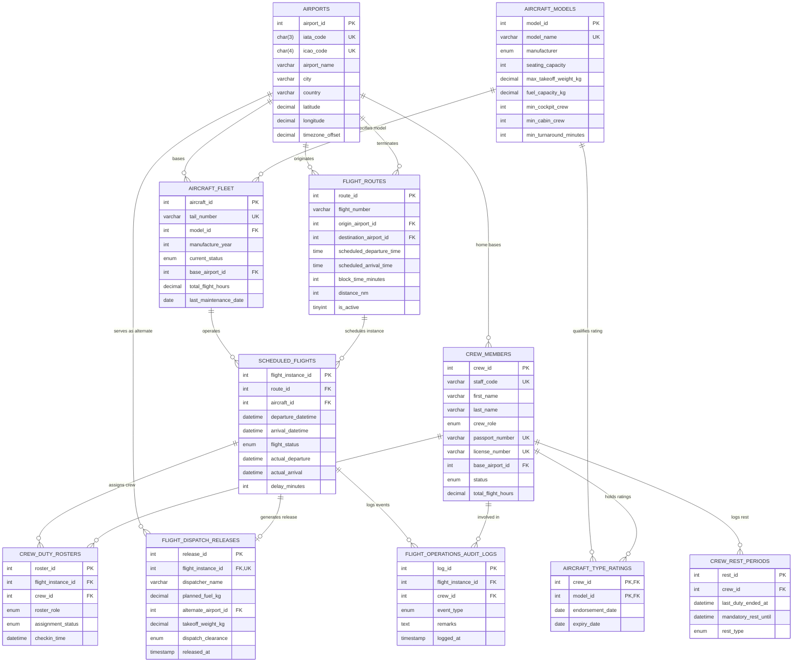

# Entity Relationship Diagram & Data Dictionary

## 1. Architectural Overview & Domain Description

The **Airline Flight Dispatch & Crew Rostering System** models mission-critical commercial airline operations. The schema is normalized to **Third Normal Form (3NF)** with strict Boyce-Codd Normal Form (BCNF) compliance across all functional dependencies. It prevents data duplication and enforces regulatory safety guardrails established by international aviation authorities (FAA 14 CFR Part 117, ICAO Annex 6, and DGCA CAR Section 7).

Key domain relationships enforced:
- **Airports** serve as departure origins, arrival destinations, crew home bases, and legal alternate recovery airfields.
- **Aircraft Fleet** is tied to certified **Aircraft Models**, inheriting seating capacity, MTOW, and turnaround minimums.
- **Scheduled Flights** instantiate recurring **Flight Routes** with specific physical airframes.
- **Flight Deck & Cabin Crew** are bound to **Rosters** subject to unexpired **Aircraft Type Ratings** and mandatory **Crew Rest Periods**.
- **Flight Dispatch Releases** enforce legal 1-to-1 operational clearance for weight and fuel envelopes before aircraft departure.
- **Flight Operations Audit Logs** track transactional life-cycle modifications (swaps, delays, clearances) with non-repudiation.

---

## 2. Mermaid.js Entity-Relationship Diagram (Crow's Foot Notation)

---

## 3. Data Dictionary & Table Schemas

### 3.1 `airports`
- **Description**: Stores commercial international aerodromes, geographical coordinates, and UTC offsets.
- **Normalization Proof**: Primary key `airport_id` transitively determines all descriptive location attributes. No non-prime dependencies exist.

| Column | Data Type | Nullable | Key | Constraints & Default | Description |
| :--- | :--- | :---: | :---: | :--- | :--- |
| `airport_id` | `INT` | No | PK | `AUTO_INCREMENT` | Unique surrogate airport identifier |
| `iata_code` | `CHAR(3)` | No | UK | Uppercase 3-letter IATA code | Globally unique IATA station designator |
| `icao_code` | `CHAR(4)` | No | UK | Uppercase 4-letter ICAO code | Globally unique ICAO station designator |
| `airport_name` | `VARCHAR(120)` | No | | | Official facility aerodrome name |
| `city` | `VARCHAR(80)` | No | | | Metropolitan area served |
| `country` | `VARCHAR(80)` | No | | | Sovereign country jurisdiction |
| `latitude` | `DECIMAL(9,6)` | No | | Decimal degrees | WGS84 latitude coordinate |
| `longitude` | `DECIMAL(9,6)` | No | | Decimal degrees | WGS84 longitude coordinate |
| `timezone_offset` | `DECIMAL(3,1)` | No | | `DEFAULT 0.0`, `[-12.0, 14.0]` | UTC time difference in decimal hours |
| `created_at` | `TIMESTAMP` | No | | `CURRENT_TIMESTAMP` | System record creation timestamp |

---

### 3.2 `aircraft_models`
- **Description**: Technical performance specifications and crew quorum rules by aircraft type.

| Column | Data Type | Nullable | Key | Constraints & Default | Description |
| :--- | :--- | :---: | :---: | :--- | :--- |
| `model_id` | `INT` | No | PK | `AUTO_INCREMENT` | Unique surrogate model identifier |
| `model_name` | `VARCHAR(50)` | No | UK | Unique aircraft family string | E.g., 'Boeing 777-300ER', 'A320neo' |
| `manufacturer` | `ENUM` | No | | `'Boeing','Airbus','Embraer','Bombardier'` | Original equipment manufacturer (OEM) |
| `seating_capacity`| `INT` | No | | `CHECK(seating_capacity > 0)` | Maximum certified passenger payload |
| `max_takeoff_weight_kg` | `DECIMAL(10,2)` | No | | | Certified Maximum Takeoff Weight (MTOW) |
| `fuel_capacity_kg` | `DECIMAL(10,2)` | No | | | Maximum usable internal fuel capacity |
| `min_cockpit_crew` | `INT` | No | | `DEFAULT 2`, `CHECK(>= 2)` | Minimum certified flight deck crew |
| `min_cabin_crew` | `INT` | No | | `CHECK(>= 2)` | Minimum certified cabin safety attendants |
| `min_turnaround_minutes` | `INT` | No | | `DEFAULT 45`, `CHECK(>= 30)` | Regulatory buffer for deboarding & fueling |
| `created_at` | `TIMESTAMP` | No | | `CURRENT_TIMESTAMP` | System record creation timestamp |

---

### 3.3 `aircraft_fleet`
- **Description**: Physical airframes registered in the operating airline's active fleet.

| Column | Data Type | Nullable | Key | Constraints & Default | Description |
| :--- | :--- | :---: | :---: | :--- | :--- |
| `aircraft_id` | `INT` | No | PK | `AUTO_INCREMENT` | Unique airframe surrogate identifier |
| `tail_number` | `VARCHAR(10)` | No | UK | E.g., 'A6-EPA', 'G-ZBKA' | International civil registration code |
| `model_id` | `INT` | No | FK | References `aircraft_models(model_id)` | Model type relationship |
| `manufacture_year` | `INT` | No | | `CHECK(1990 <= year <= 2026)` | Year of assembly delivery |
| `current_status` | `ENUM` | No | | `'Airborne','On_Ground','Maintenance','AOG'` | Operational status of airframe |
| `base_airport_id` | `INT` | No | FK | References `airports(airport_id)` | Domicile maintenance hub |
| `total_flight_hours` | `DECIMAL(8,2)` | No | | `DEFAULT 0.00` | Lifetime accumulated airframe hours |
| `last_maintenance_date` | `DATE` | Yes | | Nullable date | Date of most recent C/D-check inspection |
| `created_at` | `TIMESTAMP` | No | | `CURRENT_TIMESTAMP` | Record creation timestamp |

---

### 3.4 `flight_routes`
- **Description**: Scheduled airline routes connecting origin and destination aerodromes.

| Column | Data Type | Nullable | Key | Constraints & Default | Description |
| :--- | :--- | :---: | :---: | :--- | :--- |
| `route_id` | `INT` | No | PK | `AUTO_INCREMENT` | Unique route identifier |
| `flight_number` | `VARCHAR(10)` | No | | Combined with departure time for UK | E.g., 'EK001', 'BA107' |
| `origin_airport_id` | `INT` | No | FK | References `airports(airport_id)` | Origin airport departure station |
| `destination_airport_id`| `INT` | No | FK | References `airports(airport_id)` | Arrival destination station |
| `scheduled_departure_time` | `TIME` | No | | `UNIQUE(flight_number, time)` | Standard published departure time |
| `scheduled_arrival_time` | `TIME` | No | | | Standard published arrival time |
| `block_time_minutes` | `INT` | No | | `CHECK(block_time_minutes > 0)` | Chock-to-chock gate duration |
| `distance_nm` | `INT` | No | | `CHECK(distance_nm > 0)` | Great-circle distance in nautical miles |
| `is_active` | `TINYINT(1)` | No | | `DEFAULT 1` | Route active schedule toggle |
| `created_at` | `TIMESTAMP` | No | | `CURRENT_TIMESTAMP` | System creation timestamp |

---

### 3.5 `scheduled_flights`
- **Description**: Specific dated operations of a route assigned to an individual tail number.

| Column | Data Type | Nullable | Key | Constraints & Default | Description |
| :--- | :--- | :---: | :---: | :--- | :--- |
| `flight_instance_id` | `INT` | No | PK | `AUTO_INCREMENT` | Unique flight instance primary key |
| `route_id` | `INT` | No | FK | References `flight_routes(route_id)` | Route definition |
| `aircraft_id` | `INT` | No | FK | References `aircraft_fleet(aircraft_id)` | Assigned physical aircraft |
| `departure_datetime` | `DATETIME` | No | UK | `UNIQUE(aircraft_id, departure_datetime)` | Date and time of scheduled pushback |
| `arrival_datetime` | `DATETIME` | No | | `CHECK(arrival > departure)` | Date and time of scheduled block arrival |
| `flight_status` | `ENUM` | No | | `'Scheduled','Boarding','Departed','Arrived','Delayed','Cancelled'` | Live flight tracking status |
| `actual_departure` | `DATETIME` | Yes | | Nullable timestamp | Actual wheels-up / pushback time |
| `actual_arrival` | `DATETIME` | Yes | | Nullable timestamp | Actual gate-arrival time |
| `delay_minutes` | `INT` | No | | `DEFAULT 0`, `CHECK(delay_minutes >= 0)` | Total operational delay in minutes |
| `created_at` | `TIMESTAMP` | No | | `CURRENT_TIMESTAMP` | Instance generation timestamp |

---

### 3.6 `crew_members`
- **Description**: Airline flight deck and cabin crew staff master directory.

| Column | Data Type | Nullable | Key | Constraints & Default | Description |
| :--- | :--- | :---: | :---: | :--- | :--- |
| `crew_id` | `INT` | No | PK | `AUTO_INCREMENT` | Unique employee surrogate identifier |
| `staff_code` | `VARCHAR(15)` | No | UK | Unique company employee ID | E.g., 'PLT-1001', 'CAB-3001' |
| `first_name` | `VARCHAR(50)` | No | | | Employee legal given name |
| `last_name` | `VARCHAR(50)` | No | | | Employee legal family surname |
| `crew_role` | `ENUM` | No | | `'Captain','First_Officer','Purser','Flight_Attendant'` | Primary operational employment grade |
| `passport_number` | `VARCHAR(30)` | No | UK | Civil identity document | Government passport identification |
| `license_number` | `VARCHAR(40)` | No | UK | ATPL/CPL/Cabin certification | Civil aviation authority license code |
| `base_airport_id` | `INT` | No | FK | References `airports(airport_id)` | Domicile crew home base station |
| `status` | `ENUM` | No | | `'Active','Standby','On_Leave','Suspended'` | Operational availability flag |
| `total_flight_hours` | `DECIMAL(7,2)` | No | | `DEFAULT 0.00` | Lifetime certified flight experience |
| `created_at` | `TIMESTAMP` | No | | `CURRENT_TIMESTAMP` | Employee record registration date |

---

### 3.7 `aircraft_type_ratings`
- **Description**: Pilot aircraft family endorsements and medical/simulator validity intervals.

| Column | Data Type | Nullable | Key | Constraints & Default | Description |
| :--- | :--- | :---: | :---: | :--- | :--- |
| `crew_id` | `INT` | No | PK, FK | References `crew_members(crew_id)` | Endorsed pilot identifier |
| `model_id` | `INT` | No | PK, FK | References `aircraft_models(model_id)` | Certified aircraft model type |
| `endorsement_date` | `DATE` | No | | | Date certification simulator check passed |
| `expiry_date` | `DATE` | No | | `CHECK(expiry_date > endorsement_date)` | Recurrent training expiry date |
| `created_at` | `TIMESTAMP` | No | | `CURRENT_TIMESTAMP` | Rating entry creation date |

---

### 3.8 `crew_duty_rosters`
- **Description**: Flight-specific crew pairings associating staff with operational flights.

| Column | Data Type | Nullable | Key | Constraints & Default | Description |
| :--- | :--- | :---: | :---: | :--- | :--- |
| `roster_id` | `INT` | No | PK | `AUTO_INCREMENT` | Unique roster duty assignment key |
| `flight_instance_id` | `INT` | No | FK | References `scheduled_flights` | Target flight instance |
| `crew_id` | `INT` | No | FK | References `crew_members` | Assigned operating crew member |
| `roster_role` | `ENUM` | No | | `'Operating_Commander','Operating_CoPilot','Lead_Purser','Cabin_Crew'` | Role performed on this flight leg |
| `assignment_status` | `ENUM` | No | | `'Assigned','Checked_In','Standby_Swapped','Removed'` | Crew roster life-cycle state |
| `checkin_time` | `DATETIME` | Yes | | Nullable timestamp | Electronic dispatch check-in time |
| `assigned_at` | `TIMESTAMP` | No | | `CURRENT_TIMESTAMP` | Assignment record timestamp |

---

### 3.9 `flight_dispatch_releases`
- **Description**: Certified legal dispatch release authorization (OFP - Operational Flight Plan).

| Column | Data Type | Nullable | Key | Constraints & Default | Description |
| :--- | :--- | :---: | :---: | :--- | :--- |
| `release_id` | `INT` | No | PK | `AUTO_INCREMENT` | Unique dispatch release identifier |
| `flight_instance_id` | `INT` | No | UK, FK | References `scheduled_flights` | Exact 1:1 flight relationship |
| `dispatcher_name` | `VARCHAR(100)` | No | | Licensed flight dispatcher | Certified flight operations officer |
| `planned_fuel_kg` | `DECIMAL(8,2)` | No | | `CHECK(planned_fuel_kg > 0)` | Trip, reserve, alternate, and contingency fuel |
| `alternate_airport_id`| `INT` | No | FK | References `airports` | Mandatory IFR weather recovery diversion airport |
| `takeoff_weight_kg` | `DECIMAL(8,2)` | No | | `CHECK(takeoff_weight_kg > 0)` | Planned gross TOW |
| `dispatch_clearance`| `ENUM` | No | | `'Approved','Pending_Weather','Rejected'` | Regulatory release sign-off state |
| `released_at` | `TIMESTAMP` | No | | `CURRENT_TIMESTAMP` | Authorization release timestamp |

---

### 3.10 `crew_rest_periods`
- **Description**: Flight Duty Period (FDP) rest audit records enforcing legal non-flight intervals.

| Column | Data Type | Nullable | Key | Constraints & Default | Description |
| :--- | :--- | :---: | :---: | :--- | :--- |
| `rest_id` | `INT` | No | PK | `AUTO_INCREMENT` | Unique rest period record key |
| `crew_id` | `INT` | No | FK | References `crew_members(crew_id)` | Crew member on rest |
| `last_duty_ended_at` | `DATETIME` | No | UK | Combined with crew_id for UK | Timestamp when preceding duty ended |
| `mandatory_rest_until`| `DATETIME` | No | | `CHECK(mandatory_rest_until > last_duty)` | Earliest allowable subsequent duty report |
| `rest_type` | `ENUM` | No | | `'Pre_Flight','Post_Flight','Weekly_Rest'` | Regulatory rest categorization |
| `created_at` | `TIMESTAMP` | No | | `CURRENT_TIMESTAMP` | Record creation timestamp |

---

### 3.11 `flight_operations_audit_logs`
- **Description**: Write-only immutable audit trail for safety and operational events.

| Column | Data Type | Nullable | Key | Constraints & Default | Description |
| :--- | :--- | :---: | :---: | :--- | :--- |
| `log_id` | `INT` | No | PK | `AUTO_INCREMENT` | Unique audit event log identifier |
| `flight_instance_id` | `INT` | Yes | FK | References `scheduled_flights` | Linked flight instance (nullable on system events) |
| `crew_id` | `INT` | Yes | FK | References `crew_members` | Linked crew member (nullable on airframe events) |
| `event_type` | `ENUM` | No | | `'CREW_SWAPPED','DUTY_VIOLATION_BLOCKED','TURNAROUND_CLASH','FLIGHT_DELAYED','DISPATCH_APPROVED'` | Standardized event classification |
| `remarks` | `TEXT` | No | | Full context description | Detailed description and diagnostic data |
| `logged_at` | `TIMESTAMP` | No | | `CURRENT_TIMESTAMP` | Non-repudiable audit event timestamp |
